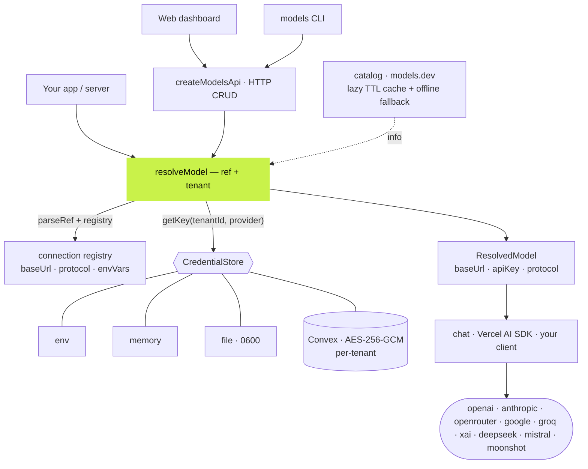
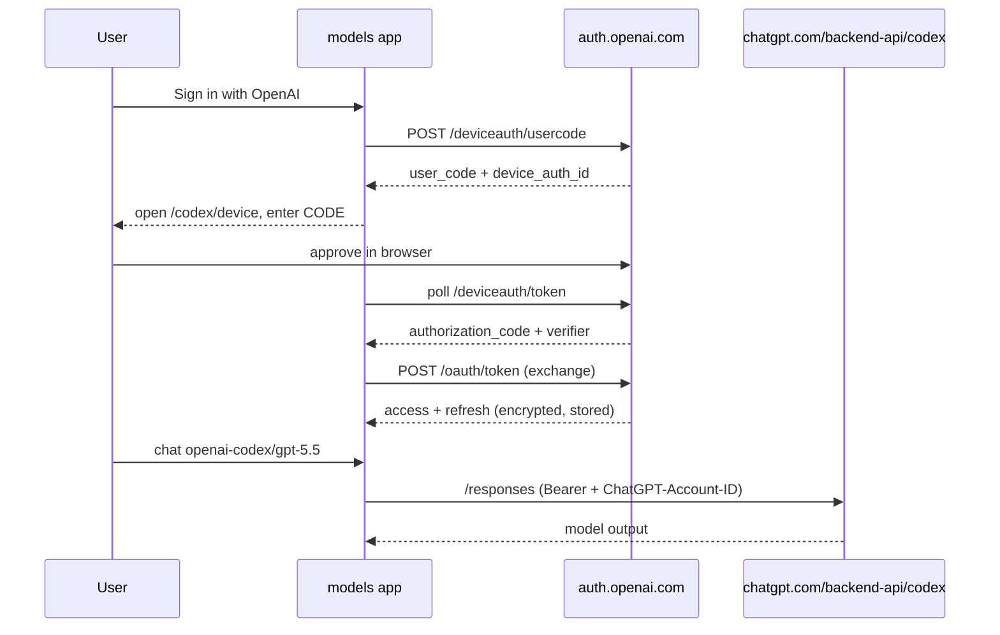

# @rahmanef/models

**A portable, multi-tenant, bring-your-own-key (BYOK) model registry.** Drop it into any project so every user or tenant brings their own provider keys, the model catalog auto-updates from [models.dev](https://models.dev), and one `resolveModel()` call turns a `"provider/model"` string plus a tenant into a ready-to-call client — host-gated, offline-first, and provider-agnostic.

**Live reference deployment: [models.rahmanef.com](https://models.rahmanef.com)** — sign up, connect a provider (OpenAI, OpenRouter, or paste any key), and use it as a full BYOK AI dashboard: a threaded **chat workbench**, task-running **agents**, **agent mode** (tool-calling), **token-saver** modes, and live **usage stats** — all on your own keys.

### What & why

[openclaw](https://github.com/openclaw/openclaw) and [hermes-agent](https://github.com/nousresearch/hermes-agent) both solve catalog management and BYOK credential handling well — but both are **single-user**, and both explicitly noted that the fix for multi-tenant is the same: *thread a tenant/credential context through provider resolution instead of reading global env / a local auth file.* This project is that fix, distilled into a zero-dependency ESM library plus a live reference app. The headline is one pluggable seam — the `CredentialStore` — that routes every credential lookup through `getKey(tenantId, provider)`, so keys can live in env, memory, a local file, or an encrypted per-tenant Convex table without touching resolution logic.

---

## Feature highlights

- **Auto-updating catalog** — capability/pricing metadata sourced wholesale from models.dev (`api.json`). No per-vendor plugin to maintain; models added upstream appear on the next read after TTL.
- **Lazy TTL cache with offline fallback** — 4-stage hierarchy (in-mem → disk-by-mtime → network → stale-disk), 1h TTL, degrades gracefully to offline, no background daemon.
- **`resolveModel()`** — turns `"provider/model"` + a tenant into `{ ref, provider, model, baseUrl, apiKey, protocol, info? }`. Pure and offline by default.
- **Host-gating (security)** — a provider's key is *pinned* to that provider's registry endpoint. A caller-supplied `baseUrl` can never redirect a known provider's key to another host (hermes' host-gated key-selection fix).
- **Pluggable `CredentialStore`** — built-in `env` (dev), `memory` (tests), `file` (local CLI, `0600` + atomic write), and an encrypted **Convex** adapter for multi-tenant BYOK.
- **Two wire protocols cover nearly everything** — `openai` (chat/completions) + `anthropic` (messages), openclaw's insight. Aggregators like OpenRouter are just OpenAI-compatible providers.
- **One HTTP CRUD surface, two front-ends** — `createModelsApi()` returns a Web-standard `(Request) => Response` handler that backs both a UI and the CLI.
- **CLI** — `models add/ls/rm/models/init`, local file store by default, or drive a remote API.
- **Zero runtime dependencies**, ESM + JSDoc, Node ≥ 22.6. Runs anywhere: Next, Convex, Bun, Deno, plain Node.

---

## Live dashboard ([models.rahmanef.com](https://models.rahmanef.com))

The reference app is evolving into a self-hosted, BYOK alternative to hosted LLM routers — built on the library above, one left-nav shell over these sections:

- **Providers** — 23 providers: OAuth sign-in (OpenAI ChatGPT/Codex device-code, OpenRouter PKCE) or paste any key. Keys are AES-256-GCM encrypted per user in Convex; never shared, never sent to another provider's host.
- **Chat workbench** — threaded, persisted conversations against any connected model.
- **AI Agents** — give a tool-capable model a task; it runs a multi-step tool loop and records a step-by-step trace.
- **Agent mode** — the chat/agents can call tools to inspect your own gateway (connected providers, usage).
- **Token savers** — Caveman (terse) / Ponytail (lazy-YAGNI) system-prompt injection to cut output tokens.
- **Usage** — per-user requests/tokens, per-model and per-day, live.
- **Admin** — operator console (identities + counts only, never a key), env-gated super-admin.

> BYOK is the foundation and never optional — every call uses the signed-in user's own credential.

---

## Architecture



The catalog (capabilities/pricing) is deliberately separate from the registry (connection facts) — hermes' lesson. `resolveModel` is pure and offline by default; it pins each known provider to its registry endpoint so a key is never sent to the wrong host, and only touches the catalog when you ask for `info`.

| Module | Responsibility |
|---|---|
| `src/catalog.js` | models.dev metadata + auto-update cache (`getCatalog`, `listModels`) |
| `src/registry.js` | connection facts per provider (`PROVIDERS`, `hostOf`) — how to *reach* a provider |
| `src/store.js` | the multi-tenant seam (`env` / `memory` / `file` stores) |
| `src/resolve.js` | `parseRef`, `resolveModel` — ref + tenant → descriptor, host-gated |
| `src/call.js` | optional `chat()` caller (openai + anthropic) |
| `src/api.js` | `createModelsApi` — Web-standard CRUD handler |
| `adapters/convex/*` | encrypted per-tenant BYOK backend (`schema`, `credentials`, `crypto`) |
| `bin/models.mjs` | terminal CLI |
| `web/` | live reference app (Next 16 + Convex Cloud + `@convex-dev/auth`) |

The catalog (capabilities/pricing) is deliberately **separate** from the registry (connection facts) — hermes' lesson. Both source projects store keys in plaintext files (fine for one local user); a shared multi-tenant DB is *not* one user, so the Convex adapter encrypts at rest with `MODELS_ENC_KEY`.

---

## Quick start (library)

```bash
npm install @rahmanef/models    # ESM only, zero runtime deps, Node ≥ 22.6
```

```js
import { resolveModel, chat, memoryCredentialStore, listModels } from '@rahmanef/models'

const store = memoryCredentialStore()          // swap for the Convex adapter in prod
await store.setKey('user_123', 'anthropic', process.env.MY_KEY)

const m = await resolveModel('anthropic/claude-opus-4-8', { tenantId: 'user_123', store })
const res = await chat(m, { messages: [{ role: 'user', content: 'hi' }] })

const catalog = await listModels()             // fresh from models.dev, cached 1h + offline fallback
```

**Core surface**

- `resolveModel(ref, { tenantId, store, baseUrl?, info? })` → `{ ref, provider, model, baseUrl, apiKey, protocol, info }`. Offline and host-gated: a provider's key is never sent to another provider's endpoint, and a rogue `baseUrl` for a *known* provider is ignored. Unknown providers require an explicit `baseUrl` (e.g. local Ollama / LM Studio). Pass `info: true` to attach models.dev metadata.
- `parseRef(ref)` → `{ provider, model }`, split on the **first** `/` so OpenRouter-style ids (`openrouter/moonshotai/kimi-k2`) work.
- `getCatalog({ force? })` / `listModels({ force? })` → models.dev metadata (context window, pricing, tool/vision/reasoning), auto-updating. `listModels` flattens to `{ ref, provider, ...meta }[]`.
- `chat(resolved, { messages, ...rest })` → optional built-in caller for the `openai` and `anthropic` protocols. Or hand the `ResolvedModel` descriptor to the Vercel AI SDK / your own client.

**CredentialStore adapters** — everything routes through `getKey(tenantId, provider)`:

| Store | Use | Notes |
|---|---|---|
| `envCredentialStore()` | dev / single-tenant | reads `MODELS_LIVE_<P>_KEY` (override) then each provider's env-var chain; read-only |
| `memoryCredentialStore()` | tests / ephemeral | `Map<tenant, Map<provider, key>>`, full CRUD |
| `fileCredentialStore(path?)` | local CLI / single-writer server | JSON at `~/.models-rahmanef/creds.json` (or `MODELS_CREDS_DIR`), mode `0600`, atomic tmp+rename |
| `adapters/convex` | multi-tenant | AES-256-GCM at rest, keyed by tenant + provider (see below) |

---

## HTTP API + CLI

Per-user model CRUD lives behind **one** Web-standard handler, so a UI and the terminal hit the same surface (the way hermes/openclaw back both their dashboards and CLIs).

### HTTP API

`createModelsApi({ store, authenticate, cors? })` returns a `(Request) => Response` handler. **You** inject auth (keep your own provider): `authenticate(req)` returns a tenant id, or `null` → `401`. Storage is any `CredentialStore`.

```js
import { createModelsApi, fileCredentialStore } from '@rahmanef/models'

const handler = createModelsApi({
  store: fileCredentialStore(),                                            // or Convex / your own store
  authenticate: (req) => verifySession(req.headers.get('authorization')),  // -> tenantId | null
  cors: true,
})
// Bun:     Bun.serve({ fetch: handler })
// Next.js: export const GET = handler  (also POST/PUT/DELETE) in app/api/models/[[...path]]/route.ts
// Convex:  http.route({ pathPrefix: '/', method: 'POST', handler: httpAction((_, req) => handler(req)) })
```

| Method & path | Does |
|---|---|
| `GET /health` | `{ ok: true }` (open) |
| `GET /providers` | the tenant's configured providers — `{ providers: [{ provider, hasKey }] }` (**keys are never returned**) |
| `PUT /providers/:provider` `{ apiKey }` | upsert a key (create + update) |
| `DELETE /providers/:provider` | remove (`204`; `405` if the store is read-only) |
| `GET /models[?all][?refresh]` | models the tenant owns, or the whole catalog with `?all` |
| `POST /chat` `{ model, messages, ... }` | call a model with the tenant's own key |

> Auth is checked **before** any outbound models.dev refresh, so an unauthenticated caller can't force a `?refresh` and amplify traffic. Empty-string ids fail closed.

### CLI

```bash
MODELS_KEY=sk-ant-… models add anthropic   # local file store (~/.models-rahmanef), no server
echo sk-ant-… | models add anthropic        # or pipe it (keeps the key out of shell history / ps)
models ls                                    # list configured providers
models models --all                          # list the whole catalog (omit --all for just yours)
models rm anthropic                          # remove a provider
models init [convexDir]                      # copy the Convex multi-tenant adapter into a project

MODELS_API=https://models.rahmanef.com MODELS_TOKEN=… models ls   # drive a remote API instead
```

Env knobs: `MODELS_KEY` (key source for `add`), `MODELS_USER` (local tenant, default `local`), `MODELS_CREDS_DIR` (store location), `MODELS_API` + `MODELS_TOKEN` (remote mode). Passing a key as a bare argument warns — prefer the env var or stdin.

### Single-file dashboard

`examples/dashboard.html` — a zero-build dashboard against the API (add/list/delete keys + a chat test). Open it, point it at your API base + token.

---

## Multi-tenant BYOK with Convex

The Convex adapter is the reference multi-tenant backend. One `modelCreds` row per `(tenant, provider)`; the value is AES-256-GCM ciphertext, never the raw key.

1. **Merge the schema** — add `modelCredsTables` from `adapters/convex/schema.ts` (the `modelCreds` table, indexed `by_tenant_provider` and `by_tenant`) into your `convex/schema.ts`.
2. **Copy the code** — `adapters/convex/{credentials,crypto}.ts` into your `convex/` (or run `models init`).
3. **Set the master key** — `npx convex env set MODELS_ENC_KEY "$(openssl rand -base64 32)"` (base64 of exactly 32 bytes; anything else is rejected).
4. **Derive `tenantId` from *your* auth** — never trust it from the client. You keep your own auth provider (Clerk / `@convex-dev/auth` / custom).

```ts
// inside a Convex action
import { convexCredentialStore } from './credentials'
import { resolveModel } from '@rahmanef/models'

const tenantId = (await ctx.auth.getUserIdentity())!.subject   // YOUR auth, server-side
const store = convexCredentialStore(ctx, api, internal)         // pass BOTH generated objects
const m = await resolveModel('openai/gpt-4o', { tenantId, store })
```

Adapter mutations/queries: `setCredential`, `deleteCredential`, `listConfiguredProviders` (returns provider slugs only), and the internal `_getRow` (reachable only via `internal`, never exposed to clients). Encryption uses Web Crypto (`crypto.subtle`, available in the Convex runtime); ciphertext is `base64(iv[12] || ciphertext)` with a fresh IV per write and a GCM auth tag that rejects tampering.

---

## OAuth sign-in (in the reference app)

The live app offers **three ways** to add access, no manual key required for the first two.

### 1. Sign in with OpenAI — ChatGPT / Codex (device-code)

A device-code OAuth flow against `auth.openai.com`: the app requests a user code, shows the user a verification URL + code, then polls until sign-in completes and exchanges the authorization code for an access/refresh token bundle. Chat then calls the **consumer ChatGPT backend** — `chatgpt.com/backend-api/codex` `/responses` (SSE) — **not** `api.openai.com`. This lets a user drive models from their existing ChatGPT/Codex subscription. Tokens are refreshed within 2 minutes of expiry, guarded by a **single-flight refresh lease** so only one concurrent request spends the single-use refresh token.



> **Honesty / gray-area note.** The Codex path is **reverse-engineered** from the official `codex` CLI (the same technique used by hermes and openclaw): it sends the CLI's `originator` header and client id, and talks to a consumer backend that has no public API contract. This is **not** an officially sanctioned OpenAI API surface, it may break at any time, and it may sit outside OpenAI's Terms of Service. **Use it only with your own account, at your own risk.** For anything production or commercial, use a real `openai` API key.

### 2. Connect OpenRouter (PKCE → issues a key)

A standard PKCE OAuth flow: the app generates a verifier/challenge, sends the user to `openrouter.ai/auth`, and on the callback exchanges the code + verifier at `openrouter.ai/api/v1/auth/keys` for a normal `sk-or-…` key, which is then stored encrypted like any other key. Fully sanctioned OpenRouter flow — hundreds of models behind one connection.

### 3. Paste an API key

Any provider in the registry: pick it, paste `sk-…`, done. Encrypted at rest, listed alongside OAuth connections.

---

## Providers

Connection registry (`src/registry.js`) — hand-maintained, add rows as needed. `catalogId` maps the slug to its models.dev provider id.

| Slug | Base URL | Protocol | Env vars |
|---|---|---|---|
| `openai` | `https://api.openai.com/v1` | openai | `OPENAI_API_KEY` |
| `anthropic` | `https://api.anthropic.com` | anthropic | `ANTHROPIC_API_KEY` |
| `google` | `https://generativelanguage.googleapis.com/v1beta/openai` | openai | `GEMINI_API_KEY`, `GOOGLE_API_KEY` |
| `openrouter` | `https://openrouter.ai/api/v1` | openai | `OPENROUTER_API_KEY` |
| `groq` | `https://api.groq.com/openai/v1` | openai | `GROQ_API_KEY` |
| `deepseek` | `https://api.deepseek.com` | openai | `DEEPSEEK_API_KEY` |
| `xai` | `https://api.x.ai/v1` | openai | `XAI_API_KEY` |
| `mistral` | `https://api.mistral.ai/v1` | openai | `MISTRAL_API_KEY` |
| `moonshotai` | `https://api.moonshot.ai/v1` | openai | `MOONSHOT_API_KEY` |

The web app adds a virtual `openai-codex` provider (ChatGPT-account OAuth, routed to the Responses backend). Unknown providers can still be resolved by passing an explicit `baseUrl` — useful for local Ollama / LM Studio endpoints.

---

## The web app

`web/` is the live, multi-tenant reference deployment at **[models.rahmanef.com](https://models.rahmanef.com)**. Stack: **Next 16** (App Router, `output: "standalone"`, Next-16 `proxy.ts` middleware) + **React 19** + **Convex Cloud** + **`@convex-dev/auth`** (Password provider). Per-user encrypted BYOK, catalog fetched from models.dev client-side, and a chat tester. All server code is Convex-direct (no `node:fs`), and every mutation/action derives `userId` from `getAuthUserId(ctx)` — never from the client.

Convex schema: `authTables` + `modelCreds` (`userId`, `provider`, `kind` = `api_key` | `oauth`, `ciphertext`, `updatedAt`, `expires?`, `refreshLeaseUntil?`) + `oauthFlows` (short-lived PKCE verifier / device-code state). Notable modules: `credentials.ts` (BYOK CRUD + single-flight `claimRefresh` lease), `oauth.ts` (Codex device-code + OpenRouter PKCE), `codexLib.ts` (pure Codex Responses-backend helpers), `chat.ts` (host-gated caller).

### Self-host / deploy

The build is **decoupled**: Convex Cloud hosts the backend, Dokploy (self-hosted, `output: "standalone"`, any Next host works) hosts the frontend.

1. **Convex Cloud** — `npx convex deploy`. Set backend env: `MODELS_ENC_KEY` (`openssl rand -base64 32`), `SITE_URL` (e.g. `https://models.rahmanef.com`, used to build the OpenRouter callback and to resolve the public origin behind a reverse proxy). Auth keys (`JWT_PRIVATE_KEY` + JWKS) are provisioned by `npx @convex-dev/auth`.
2. **Frontend** — set `NEXT_PUBLIC_CONVEX_URL` + `SITE_URL` in the host's env (inlined/read at build+runtime), then `next build`. Deploys auto-trigger on push to `main` (Dokploy `autoDeploy`). Behind a proxy, always resolve the public origin via `lib/origin.ts`'s `publicOrigin()` — never `req.nextUrl.origin` (resolves to the standalone server's own bind address, `0.0.0.0:3000`, not the public host).
3. **OAuth callback** — `web/app/oauth/openrouter/callback/route.ts` exchanges the OpenRouter code as the logged-in user and bounces back to the dashboard.

---

## Security notes

- **Host-gating** — `resolveModel` pins each known provider to its registry `baseUrl`; a caller-supplied `baseUrl` is honored *only* for unknown providers. A provider's key can never be sent to another provider's host (test-enforced against a spoofed `baseUrl`).
- **Encryption at rest** — the Convex adapter and web app store AES-256-GCM ciphertext (`base64(iv || ct)`, fresh IV per write, auth tag rejects tampering) under `MODELS_ENC_KEY`. Raw keys are never persisted and never returned by any read path (`listConfiguredProviders` / `GET /providers` return slugs only).
- **Per-user isolation** — every credential lookup is scoped by tenant; the web app derives the tenant from the authed session (`getAuthUserId`), never from client input. Tests assert one tenant can't see another's providers.
- **Fail-closed auth** — the HTTP API rejects empty/absent ids with `401` and gates auth *before* any outbound refresh.
- **Single-flight refresh lease** — for rotating OAuth tokens (Codex), only the lease winner spends the single-use refresh token; others briefly wait and re-read. Prevents a refresh-token race under concurrent chats.
- **Local file store** — `0600` perms with atomic tmp+rename (never a truncated creds file on crash). Last-writer-wins under concurrent writers; add locking if you have many.

---

## Testing

```bash
npm test
```

Runs three offline self-checks — no network, no real keys:

- `test.mjs` — ref parsing, per-tenant isolation, host-gate (including a spoofed `baseUrl`), missing-key rejection, and custom-endpoint resolution.
- `api.test.mjs` — HTTP API auth gating, CRUD upsert/delete, per-user isolation, read-only-store `405`, and *no key leak*.
- `adapters/convex/crypto.test.ts` — AES-256-GCM round-trip, unique IV per call, tamper rejection, bad-key-size rejection (native TS type-stripping, hence Node ≥ 22.6).

---

## Roadmap

- [x] **Phase 0 — core library**: catalog auto-update, connection registry, `resolveModel` + host-gate, env/memory/file stores, `chat` caller, self-check.
- [x] **Phase 1 — Convex multi-tenant adapter**: encrypted per-tenant BYOK table + store + mutations.
- [x] **Phase 2 — two front-ends over one surface**: HTTP CRUD API (`createModelsApi`), terminal CLI (`add/ls/rm/models/init`, local file store or remote API), and a single-file demo dashboard. `models init` scaffolds the Convex adapter into a host project.
- [x] **Phase 3 — deploy**: **LIVE at [models.rahmanef.com](https://models.rahmanef.com)** (Dokploy + Convex Cloud). Per-user encrypted BYOK, three connect methods (OpenAI Codex device-code, OpenRouter PKCE, paste key), models.dev catalog, chat tester.
- [ ] **Phase 4 (optional)**: per-provider live `/v1/models` merge for local/custom endpoints (Ollama / LM Studio), multi-key rotation on rate-limit, and more PKCE OAuth flows (openclaw/hermes patterns).

---

## Credits

Distilled from two mature single-user agent codebases:

- **[openclaw](https://github.com/openclaw/openclaw)** — `provider/model` split-on-first-`/` + wildcard allowlist, env-var priority chain with a `LIVE` override, two-wire-protocol transport insight, PKCE OAuth patterns.
- **[hermes-agent](https://github.com/nousresearch/hermes-agent)** — models.dev as the whole catalog, lazy TTL cache with stale fallback + force-refresh, and the host-gated key-selection security fix (resolve `base_url` first, then only pick a key whose host matches).
- **[models.dev](https://models.dev)** — the community model capability/pricing database that powers the auto-updating catalog.
- **[Convex](https://convex.dev)** — reactive backend + runtime for the encrypted multi-tenant credential store and the live reference app.

Both source projects noted that the multi-tenant fix was the same — thread a tenant/credential context through resolution. `@rahmanef/models` is that fix, packaged for reuse.

MIT © rahmanef
